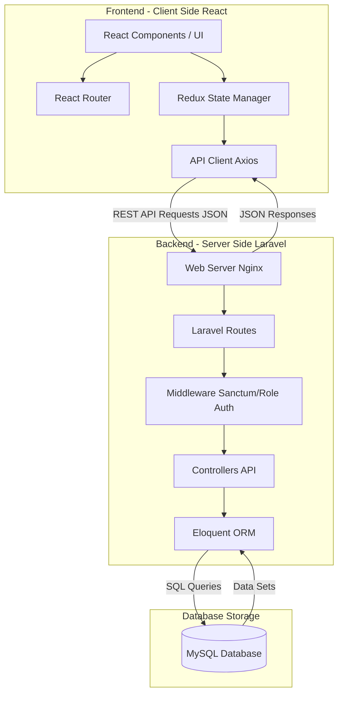
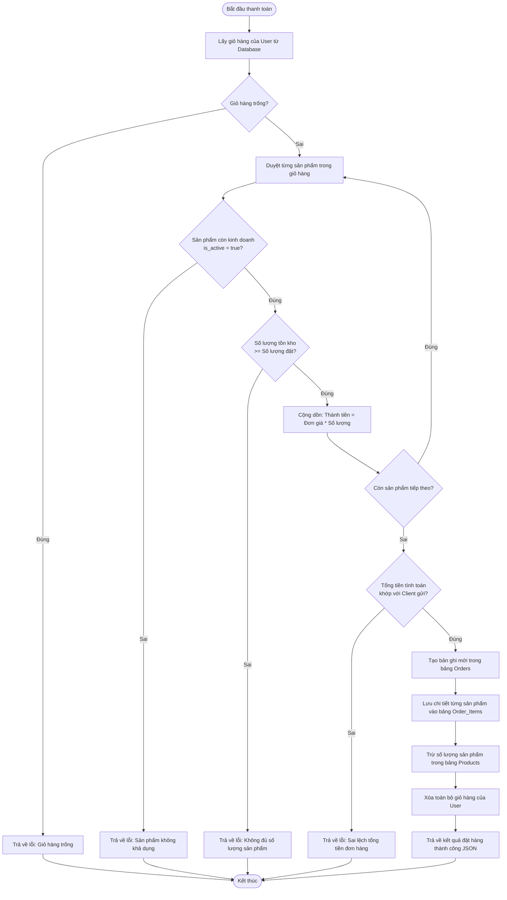
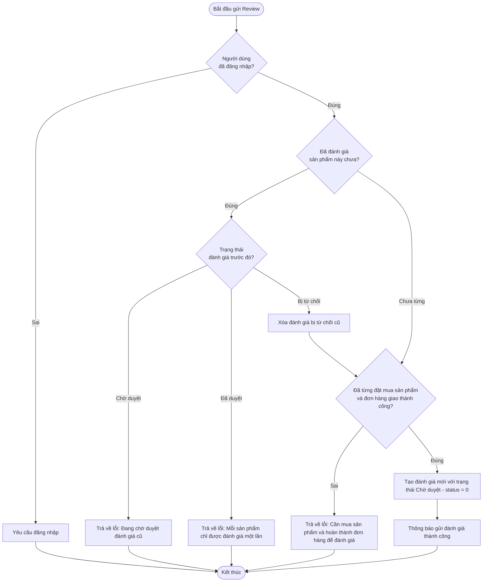
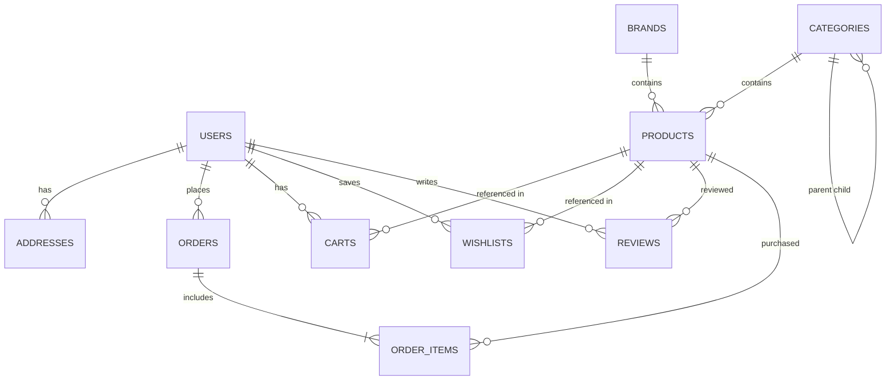

# CHƯƠNG 2: THIẾT KẾ GIẢI PHÁP

Chương này trình bày chi tiết về thiết kế kiến trúc tổng thể của hệ thống, vai trò của từng thành phần, các thuật toán/quy trình xử lý nghiệp vụ cốt lõi và mô hình cơ sở dữ liệu chi tiết của hệ thống thương mại điện tử bán dụng cụ học tập.

---

## 2.1. Thiết kế kiến trúc tổng thể của hệ thống

Hệ thống được xây dựng theo kiến trúc tách biệt **Client-Server** sử dụng mô hình ứng dụng đơn trang (**SPA - Single Page Application**). Trải nghiệm người dùng ở phía giao diện hoàn toàn độc lập và giao tiếp với phía máy chủ thông qua giao thức HTTP/HTTPS bằng định dạng dữ liệu JSON thông qua hệ thống **RESTful API**.

### Sơ đồ kiến trúc tổng thể

### Giải thích luồng hoạt động
1. **Phía Client:** Người dùng tương tác với giao diện React. Các trạng thái ứng dụng được quản lý tập trung bằng **Redux**. Khi cần lấy hoặc thay đổi dữ liệu, Client sử dụng **Axios** để gửi yêu cầu HTTP (chứa JWT token trong header nếu là tác vụ cần đăng nhập) lên máy chủ API.
2. **Phía Server:** **Nginx/Apache** nhận request và chuyển tiếp tới framework **Laravel**. Yêu cầu đi qua bộ lọc **Middleware** để xác thực Token (thông qua **Laravel Sanctum**) và kiểm tra quyền truy cập (Admin hoặc Member). Sau đó, Router định tuyến yêu cầu đến **Controller** tương ứng.
3. **Truy vấn Cơ sở dữ liệu:** Controller sử dụng **Eloquent ORM** (Object-Relational Mapping) để xây dựng các câu lệnh SQL an toàn, gửi truy vấn đến hệ quản trị cơ sở dữ liệu **MySQL** và nhận kết quả trả về dưới dạng đối tượng (Collection/Model).
4. **Phản hồi dữ liệu:** Controller định dạng kết quả dưới dạng cấu trúc JSON chuẩn và gửi trả về phía Client. React cập nhật trạng thái Redux và hiển thị lại (Re-render) giao diện cho người dùng mà không cần tải lại toàn bộ trang.

---

## 2.2. Chức năng chi tiết của các thành phần trong hệ thống

Hệ thống được chia thành hai nhánh chính: Giao diện Client (Frontend) và Dịch vụ xử lý API (Backend).

### 2.2.1. Các thành phần phía Client (Frontend - React)
*   **App / Index:** Điểm khởi chạy của ứng dụng, cấu hình Redux Store và React Router cho toàn bộ ứng dụng.
*   **Containers (Trang nghiệp vụ chính):**
    *   `Homepage`: Giao diện trang chủ hiển thị các biểu ngữ (banners), danh mục nổi bật và sản phẩm mới nhất.
    *   `Shop/Product`: Trang danh sách sản phẩm tích hợp bộ lọc tìm kiếm theo nhiều tiêu chí khác nhau.
    *   `Cart`: Quản lý giỏ hàng tạm thời của khách hàng.
    *   `Checkout/Order`: Xử lý điền thông tin giao hàng và xác nhận thanh toán/đơn hàng.
    *   `Admin Dashboard`: Giao diện dành riêng cho quản trị viên để quản lý đơn hàng, danh mục, thương hiệu, sản phẩm và duyệt đánh giá.
    *   `User Dashboard`: Giao diện cho thành viên cập nhật thông tin cá nhân, sổ địa chỉ, xem lịch sử đơn hàng và danh sách sản phẩm yêu thích (Wishlist).
*   **Components (Thành phần giao diện dùng chung):** Các thẻ hiển thị sản phẩm (Product Card), thanh tìm kiếm, thanh điều hướng (Navbar), chân trang (Footer), modal hiển thị thông báo lỗi/thành công, v.v.
*   **Redux Store (Actions, Reducers, Constants):** Quản lý trạng thái chia sẻ toàn ứng dụng bao gồm trạng thái đăng nhập của người dùng, nội dung giỏ hàng hiện tại, danh sách sản phẩm đang tìm kiếm.

### 2.2.2. Các thành phần phía Server (Backend - Laravel)
*   **Router (`routes/api.php`):** Khai báo các đường dẫn API và gán các bộ lọc xác thực (Middleware Sanctum) để bảo vệ tài nguyên hệ thống.
*   **Middleware:**
    *   `auth:sanctum`: Xác thực tính hợp lệ của token đính kèm trong request.
    *   `role:admin`: Phân quyền, chỉ cho phép tài khoản có vai trò Admin (`ROLE ADMIN`) truy cập vào các API quản trị.
*   **Controllers (Bộ điều khiển nghiệp vụ):**
    *   [AuthController](file:///wsl.localhost/Ubuntu/home/vutt/workspace/freelance/dung-cu-hoc-tap/backend/app/Http/Controllers/Api/AuthController.php): Xử lý đăng ký, đăng nhập, đăng xuất, phục hồi mật khẩu và liên kết đăng nhập mạng xã hội (Google OAuth).
    *   [ProductController](file:///wsl.localhost/Ubuntu/home/vutt/workspace/freelance/dung-cu-hoc-tap/backend/app/Http/Controllers/Api/ProductController.php): Quản lý vòng đời sản phẩm (hiển thị danh sách lọc, chi tiết sản phẩm, thêm/sửa/xóa sản phẩm và chuyển đổi trạng thái kích hoạt).
    *   [OrderController](file:///wsl.localhost/Ubuntu/home/vutt/workspace/freelance/dung-cu-hoc-tap/backend/app/Http/Controllers/Api/OrderController.php): Tiếp nhận yêu cầu đặt hàng, xác nhận giỏ hàng, cập nhật trạng thái đơn hàng (xử lý, vận chuyển, hoàn thành, hủy đơn).
    *   [ReviewController](file:///wsl.localhost/Ubuntu/home/vutt/workspace/freelance/dung-cu-hoc-tap/backend/app/Http/Controllers/Api/ReviewController.php): Quản lý đánh giá sản phẩm từ người dùng, kiểm tra điều kiện được phép đánh giá và quy trình duyệt đánh giá của Admin.
    *   `CategoryController` & `BrandController`: Quản lý danh mục và thương hiệu của các dụng cụ học tập.
    *   `UserController` & `AddressController`: Quản lý thông tin tài khoản và danh sách địa chỉ giao hàng của người dùng.
    *   `WishlistController`: Lưu trữ danh sách các sản phẩm ưa thích của mỗi thành viên.

---

## 2.3. Các thuật toán và quy trình xử lý chính

### 2.3.1. Thuật toán Đặt hàng và Kiểm tra tồn kho (Checkout & Inventory Control)
Đây là thuật toán quan trọng nhất đảm bảo tính chính xác của dữ liệu giao dịch và ngăn chặn tình trạng đặt mua quá số lượng tồn kho thực tế.

#### Sơ đồ quy trình (Flowchart)

---

### 2.3.2. Thuật toán Lọc sản phẩm đa điều kiện (Multi-criteria Searching & Filtering)
Thuật toán này xử lý việc xây dựng truy vấn động dựa trên các tham số không bắt buộc từ yêu cầu tìm kiếm của người dùng (tên sản phẩm, khoảng giá, đánh giá trung bình, thương hiệu, danh mục).

#### Các bước xử lý trong thuật toán
1. **Khởi tạo câu truy vấn gốc:** Lấy danh sách sản phẩm kèm thông tin liên kết của Thương hiệu (`brand`) và Danh mục (`category`).
2. **Bộ lọc Trạng thái:** Nếu không phải tài khoản quản trị (Admin), hệ thống chỉ lọc các sản phẩm đang được kích hoạt bán (`is_active = true`).
3. **Bộ lọc Danh mục & Thương hiệu:** 
   * Kiểm tra tham số `category` và `brand` truyền lên. Nếu khác giá trị mặc định `'all'`, thêm điều kiện `whereHas` đối với quan hệ liên kết bằng ID hoặc chuỗi định danh tĩnh (slug).
4. **Bộ lọc Khoảng giá:** Nếu tồn tại đồng thời tham số giá trị nhỏ nhất `min` và lớn nhất `max`, thêm điều kiện lọc khoảng giá `whereBetween('price', [min, max])`.
5. **Bộ lọc Đánh giá sản phẩm:** Nếu yêu cầu lọc theo số sao tối thiểu (ví dụ `>= 4` sao), thực hiện tính toán giá trị trung bình cột `rating` của bảng `reviews` liên kết và thêm mệnh đề lọc `having('reviews_avg_rating', '>=', rating)`.
6. **Tìm kiếm văn bản (Search String):** Nếu có từ khóa tìm kiếm (`search` hoặc `name`), tiến hành tạo nhóm điều kiện loại trừ sử dụng toán tử `LIKE %keyword%` tìm kiếm trên các trường: Tên sản phẩm (`name`), mã định danh (`sku`), và mô tả (`description`).
7. **Sắp xếp kết quả (Sorting):** Áp dụng mệnh đề sắp xếp tương ứng với các lựa chọn: Giá tăng dần (`price_asc`), Giá giảm dần (`price_desc`), Tên từ A-Z (`name_asc`), Tên từ Z-A (`name_desc`), hoặc Mới nhất (mặc định).
8. **Phân trang dữ liệu (Pagination):** Thực hiện phân trang tự động dựa trên tham số `limit` gửi từ Frontend (mặc định 12 sản phẩm mỗi trang, giới hạn tối đa 200 sản phẩm để bảo vệ tài nguyên hệ thống).

---

### 2.3.3. Thuật toán Kiểm tra điều kiện đánh giá sản phẩm (Review Eligibility Verification)
Để đảm bảo tính khách quan và trung thực cho hệ thống đánh giá dụng cụ học tập, ứng dụng áp dụng quy trình kiểm duyệt chặt chẽ đối với người đánh giá.

#### Quy trình kiểm tra điều kiện

---

## 2.4. Thiết kế cơ sở dữ liệu (Database Design)

Hệ thống sử dụng cơ sở dữ liệu quan hệ MySQL nhằm đảm bảo tính toàn vẹn của dữ liệu giao dịch đơn hàng qua các ràng buộc khóa ngoại (Foreign Keys) chặt chẽ.

### 2.4.1. Sơ đồ quan hệ thực thể (ERD)

---

### 2.4.2. Chi tiết cấu trúc các bảng dữ liệu

#### 1. Bảng `users` (Quản lý tài khoản người dùng)
Lưu trữ thông tin người dùng bao gồm khách hàng (members) và quản trị viên (admins).

| Tên trường | Kiểu dữ liệu | Ràng buộc | Mô tả |
| :--- | :--- | :--- | :--- |
| `id` | BIGINT UNSIGNED | Primary Key, Auto Increment | Mã định danh người dùng |
| `email` | VARCHAR(255) | Unique, Not Null | Địa chỉ email đăng nhập |
| `phone_number` | VARCHAR(255) | Nullable | Số điện thoại liên lạc |
| `first_name` | VARCHAR(255) | Not Null | Tên |
| `last_name` | VARCHAR(255) | Not Null | Họ đệm |
| `password` | VARCHAR(255) | Not Null | Mật khẩu băm (bcrypt) |
| `provider` | VARCHAR(255) | Nullable | Nhà cung cấp đăng nhập (Email, Google) |
| `google_id` | VARCHAR(255) | Nullable | ID định danh từ Google OAuth |
| `facebook_id`| VARCHAR(255) | Nullable | ID định danh từ Facebook |
| `avatar` | VARCHAR(255) | Nullable | Đường dẫn ảnh đại diện |
| `role` | VARCHAR(255) | Default: `'member'` | Quyền hạn: `'admin'`, `'member'` |
| `reset_password_token` | VARCHAR(255) | Nullable | Token phục hồi mật khẩu |
| `reset_password_expires` | TIMESTAMP | Nullable | Thời gian hết hạn của reset token |
| `created_at` / `updated_at` | TIMESTAMP | Nullable | Thời gian tạo và cập nhật bản ghi |

#### 2. Bảng `brands` (Danh mục thương hiệu dụng cụ học tập)
Lưu trữ danh sách các nhà sản xuất/nhãn hàng dụng cụ học tập như Thiên Long, Hồng Hà, Deli, Campus,...

| Tên trường | Kiểu dữ liệu | Ràng buộc | Mô tả |
| :--- | :--- | :--- | :--- |
| `id` | BIGINT UNSIGNED | Primary Key, Auto Increment | Mã thương hiệu |
| `name` | VARCHAR(255) | Not Null | Tên thương hiệu |
| `slug` | VARCHAR(255) | Unique, Not Null | Chuỗi định danh tĩnh URL thương hiệu |
| `description` | TEXT | Nullable | Mô tả chi tiết về thương hiệu |
| `is_active` | BOOLEAN | Default: `true` | Trạng thái hiển thị thương hiệu |
| `created_at` / `updated_at` | TIMESTAMP | Nullable | Thời gian lưu dữ liệu |

#### 3. Bảng `categories` (Danh mục sản phẩm dụng cụ học tập)
Danh sách các danh mục hàng hóa (ví dụ: Bút - Viết, Sách vở, Dụng cụ vẽ, Máy tính bỏ túi). Có quan hệ đệ quy `parent_id` để thiết lập danh mục đa cấp.

| Tên trường | Kiểu dữ liệu | Ràng buộc | Mô tả |
| :--- | :--- | :--- | :--- |
| `id` | BIGINT UNSIGNED | Primary Key, Auto Increment | Mã danh mục |
| `name` | VARCHAR(255) | Not Null | Tên danh mục |
| `slug` | VARCHAR(255) | Unique, Not Null | Chuỗi định danh tĩnh danh mục |
| `description` | TEXT | Nullable | Mô tả danh mục |
| `parent_id` | BIGINT UNSIGNED | Foreign Key -> `categories.id` | Mã danh mục cha |
| `is_active` | BOOLEAN | Default: `true` | Trạng thái hiển thị danh mục |
| `created_at` / `updated_at` | TIMESTAMP | Nullable | Thời gian lưu |

#### 4. Bảng `products` (Danh sách sản phẩm dụng cụ học tập)
Lưu trữ thông tin chi tiết về từng mặt hàng dụng cụ học tập trong kho hàng.

| Tên trường | Kiểu dữ liệu | Ràng buộc | Mô tả |
| :--- | :--- | :--- | :--- |
| `id` | BIGINT UNSIGNED | Primary Key, Auto Increment | Mã sản phẩm |
| `sku` | VARCHAR(255) | Unique, Not Null | Mã quản lý kho hàng duy nhất |
| `name` | VARCHAR(255) | Not Null | Tên dụng cụ học tập |
| `slug` | VARCHAR(255) | Unique, Not Null | Chuỗi định danh tĩnh sản phẩm |
| `image_url` | VARCHAR(255) | Nullable | Đường dẫn liên kết trực tiếp ảnh |
| `image_key` | VARCHAR(255) | Nullable | Đường dẫn lưu trữ vật lý trên server |
| `description` | TEXT | Nullable | Bài viết mô tả chi tiết sản phẩm |
| `quantity` | INT | Default: `0`, Not Null | Số lượng tồn kho hiện tại |
| `price` | DECIMAL(10, 2) | Not Null | Đơn giá sản phẩm |
| `taxable` | BOOLEAN | Default: `false` | Có áp dụng thuế giá trị gia tăng VAT |
| `is_active` | BOOLEAN | Default: `true` | Trạng thái hiển thị/mở bán |
| `brand_id` | BIGINT UNSIGNED | Foreign Key -> `brands.id` | Liên kết thương hiệu |
| `category_id`| BIGINT UNSIGNED | Foreign Key -> `categories.id` | Liên kết danh mục sản phẩm |
| `created_at` / `updated_at` | TIMESTAMP | Nullable | Thời gian lưu |

#### 5. Bảng `addresses` (Sổ địa chỉ giao nhận hàng của người dùng)
Một người dùng có thể lưu nhiều địa chỉ nhận hàng để thuận tiện khi mua sắm.

| Tên trường | Kiểu dữ liệu | Ràng buộc | Mô tả |
| :--- | :--- | :--- | :--- |
| `id` | BIGINT UNSIGNED | Primary Key, Auto Increment | Mã địa chỉ |
| `user_id` | BIGINT UNSIGNED | Foreign Key -> `users.id` | Liên kết tới tài khoản người dùng |
| `address` | VARCHAR(255) | Not Null | Số nhà, tên đường, phường/xã |
| `city` | VARCHAR(255) | Not Null | Quận/Huyện, Tỉnh/Thành phố |
| `state` | VARCHAR(255) | Nullable | Vùng miền/Bang |
| `zip_code` | VARCHAR(255) | Nullable | Mã bưu chính |
| `country` | VARCHAR(255) | Nullable | Quốc gia |
| `phone_number` | VARCHAR(255) | Nullable | Số điện thoại nhận hàng tại địa chỉ này |
| `is_default` | BOOLEAN | Default: `false` | Địa chỉ giao hàng mặc định của khách |
| `created_at` / `updated_at` | TIMESTAMP | Nullable | Thời gian lưu |

#### 6. Bảng `orders` (Danh sách đơn đặt hàng)
Lưu trữ thông tin khái quát về giao dịch mua bán và các thông tin liên quan đến vận chuyển tại thời điểm đặt hàng.

| Tên trường | Kiểu dữ liệu | Ràng buộc | Mô tả |
| :--- | :--- | :--- | :--- |
| `id` | BIGINT UNSIGNED | Primary Key, Auto Increment | Mã đơn hàng |
| `user_id` | BIGINT UNSIGNED | Foreign Key -> `users.id`, Nullable | Người đặt (null nếu xóa tài khoản) |
| `order_number` | VARCHAR(255) | Unique, Not Null | Mã đơn hàng sinh ngẫu nhiên (ORD-XXXXXXXX) |
| `total` | DECIMAL(10, 2) | Not Null | Tổng giá trị đơn hàng |
| `status` | VARCHAR(255) | Default: `'pending'` | Trạng thái: `'pending'`, `'processing'`, `'completed'`, `'cancelled'` |
| `notes` | TEXT | Nullable | Ghi chú thêm của khách hàng |
| `shipping_name` | VARCHAR(255) | Nullable | Tên người nhận (ảnh chụp lúc đặt hàng) |
| `shipping_phone` | VARCHAR(255) | Nullable | Số điện thoại nhận hàng |
| `shipping_address` | VARCHAR(255) | Nullable | Địa chỉ giao nhận chi tiết |
| `shipping_note` | TEXT | Nullable | Ghi chú vận chuyển |
| `created_at` / `updated_at` | TIMESTAMP | Nullable | Thời gian đặt hàng và cập nhật |

#### 7. Bảng `order_items` (Chi tiết các mặt hàng trong đơn hàng)
Lưu thông tin chi tiết về từng mặt hàng được mua tại thời điểm giao dịch thành công. Việc chụp lại tên sản phẩm và đơn giá bán lúc mua là bắt buộc để lưu trữ lịch sử mua bán chính xác ngay cả khi sản phẩm gốc bị thay đổi thông tin hoặc xóa bỏ sau này.

| Tên trường | Kiểu dữ liệu | Ràng buộc | Mô tả |
| :--- | :--- | :--- | :--- |
| `id` | BIGINT UNSIGNED | Primary Key, Auto Increment | Mã dòng sản phẩm mua |
| `order_id` | BIGINT UNSIGNED | Foreign Key -> `orders.id` | Thuộc đơn hàng nào |
| `product_id` | BIGINT UNSIGNED | Foreign Key -> `products.id`, Nullable | Mã liên kết sản phẩm hiện tại |
| `product_name` | VARCHAR(255) | Not Null | Tên sản phẩm tại thời điểm mua (Snapshot) |
| `price` | DECIMAL(10, 2) | Not Null | Đơn giá sản phẩm tại thời điểm mua (Snapshot) |
| `quantity` | INT | Not Null | Số lượng mua sản phẩm này |
| `total` | DECIMAL(10, 2) | Not Null | Thành tiền (price * quantity) |
| `status` | VARCHAR(255) | Nullable | Trạng thái giao hàng của mặt hàng này |
| `created_at` / `updated_at` | TIMESTAMP | Nullable | Thời gian lưu |

#### 8. Bảng `carts` (Quản lý giỏ hàng của người dùng)
Lưu trữ giỏ hàng hiện tại của khách hàng đã đăng nhập để có thể đồng bộ hóa trên nhiều thiết bị khác nhau.

| Tên trường | Kiểu dữ liệu | Ràng buộc | Mô tả |
| :--- | :--- | :--- | :--- |
| `id` | BIGINT UNSIGNED | Primary Key, Auto Increment | Mã mục trong giỏ hàng |
| `user_id` | BIGINT UNSIGNED | Foreign Key -> `users.id` | Thuộc sở hữu của khách hàng nào |
| `product_id` | BIGINT UNSIGNED | Foreign Key -> `products.id` | Sản phẩm được chọn vào giỏ |
| `quantity` | INT | Default: `1`, Not Null | Số lượng lựa chọn |
| `price` | DECIMAL(10, 2) | Nullable | Đơn giá ghi nhận |
| `created_at` / `updated_at` | TIMESTAMP | Nullable | Thời gian lưu |

#### 9. Bảng `wishlists` (Sản phẩm yêu thích)
Lưu giữ danh sách sản phẩm yêu thích của khách hàng thành viên.

| Tên trường | Kiểu dữ liệu | Ràng buộc | Mô tả |
| :--- | :--- | :--- | :--- |
| `id` | BIGINT UNSIGNED | Primary Key, Auto Increment | Mã bản ghi |
| `user_id` | BIGINT UNSIGNED | Foreign Key -> `users.id` | Mã khách hàng |
| `product_id` | BIGINT UNSIGNED | Foreign Key -> `products.id` | Mã sản phẩm được lưu |
| `created_at` / `updated_at` | TIMESTAMP | Nullable | Thời gian lưu |

#### 10. Bảng `reviews` (Đánh giá và phản hồi của khách hàng)
Hệ thống đánh giá sản phẩm theo sao và nhận xét từ những người mua hàng thực tế sau khi nhận sản phẩm.

| Tên trường | Kiểu dữ liệu | Ràng buộc | Mô tả |
| :--- | :--- | :--- | :--- |
| `id` | BIGINT UNSIGNED | Primary Key, Auto Increment | Mã đánh giá |
| `user_id` | BIGINT UNSIGNED | Foreign Key -> `users.id` | Người viết đánh giá |
| `product_id` | BIGINT UNSIGNED | Foreign Key -> `products.id` | Sản phẩm được đánh giá |
| `title` | VARCHAR(255) | Nullable | Tiêu đề tóm tắt đánh giá |
| `comment` | TEXT | Nullable | Nội dung chi tiết phản hồi |
| `rating` | INT | Default: `5`, Not Null | Số sao đánh giá (từ 1 đến 5 sao) |
| `status` | INT | Default: `0`, Not Null | Trạng thái: `0` (Chờ duyệt), `1` (Đã duyệt), `-1` (Từ chối) |
| `created_at` / `updated_at` | TIMESTAMP | Nullable | Thời gian đăng |
